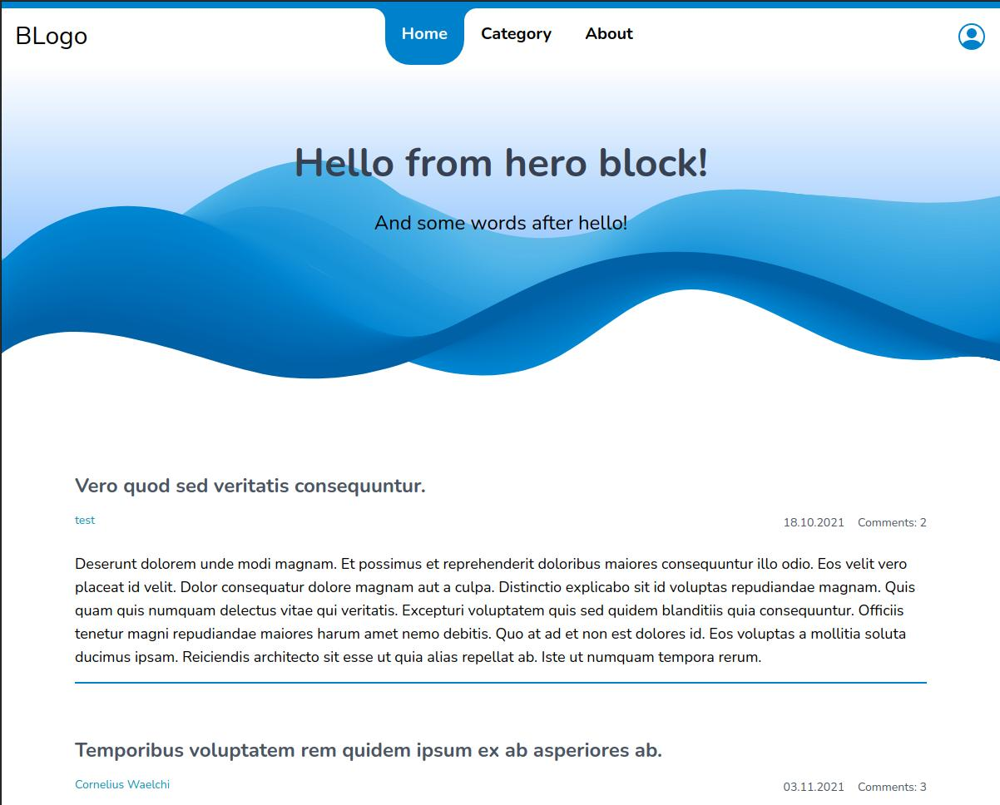
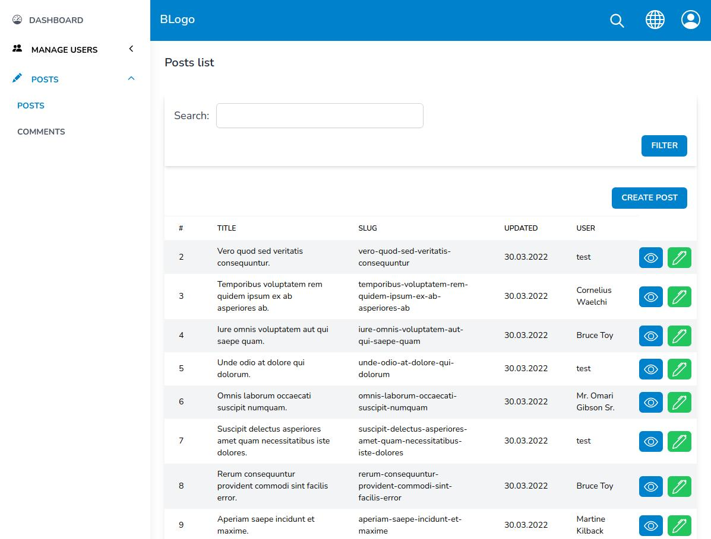

## BLogo 
Example of blog-platform on laravel framework.
* Use laravel/sanctum for authentication.
* Use Vue 3 (Composition API), InertiaJS and TailwindCss for frontend.
* Docker dev environment

> ! Many helpfully things started from makefile.

## Roadmap:
### Work in progress.

1. [X] Add subscribe newsletter.
2. [X] Add localization to Vuejs and InertiaJS.
3. [X] Add endless scroll for posts.
4. [X] Setup soketi (pusher open-source alternative).
5. [ ] Add websocket notification user.
6. [ ] Add polymorphic like for posts and comments.

## Start local environment.

Need installed php8, composer, nodejs and npm locally.

```shell
git clone https://github.com/vlsvl/blogo &&
cd blogo &&
composer install &&
npm i && npm run dev &&
make 
```

## Preview


